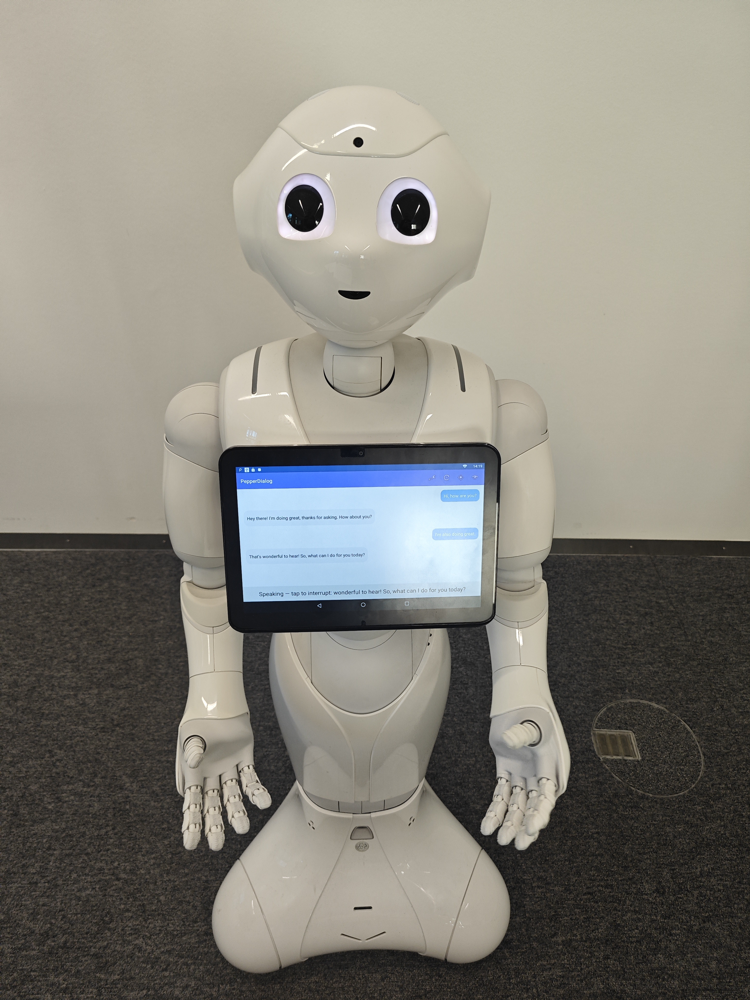
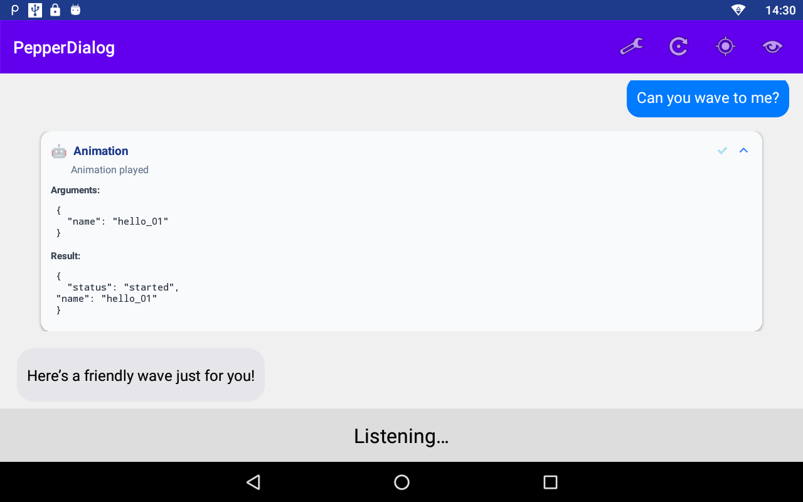
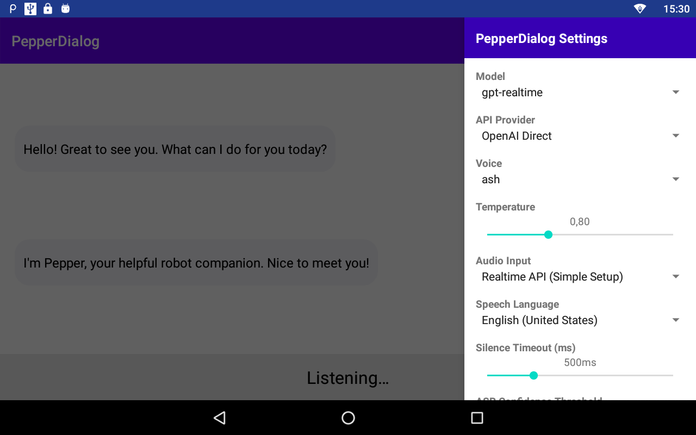
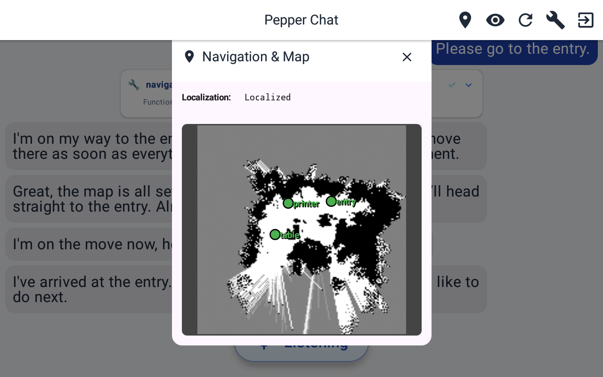
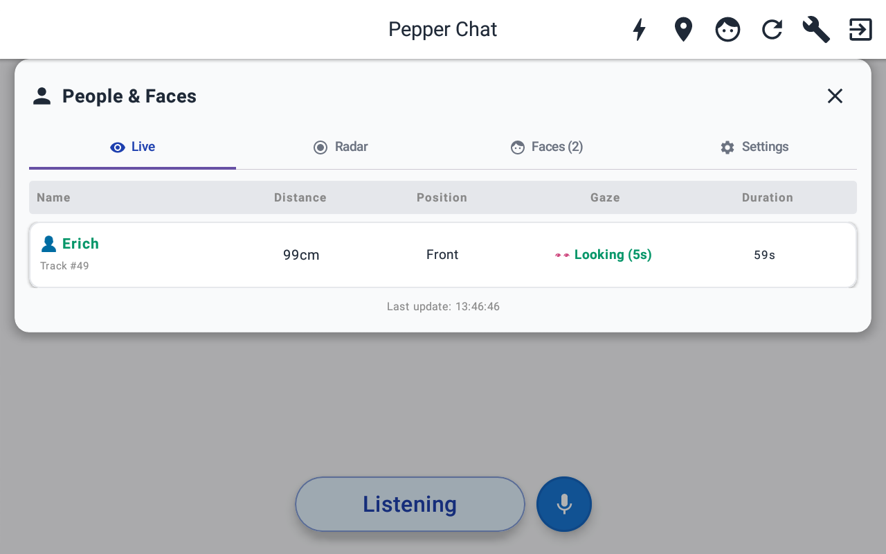
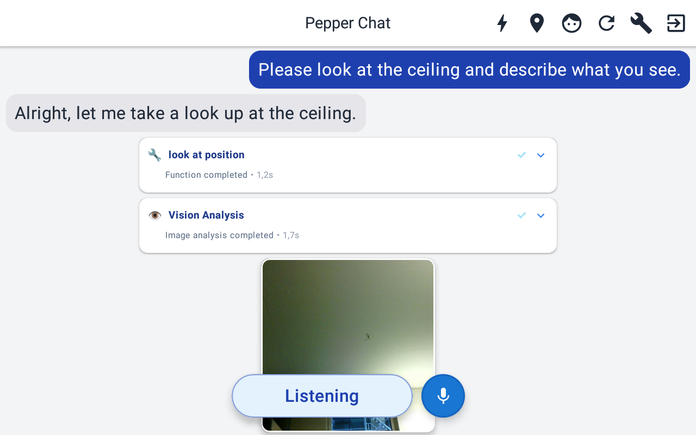
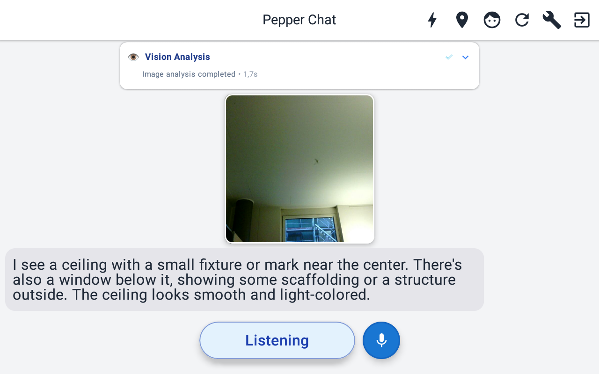
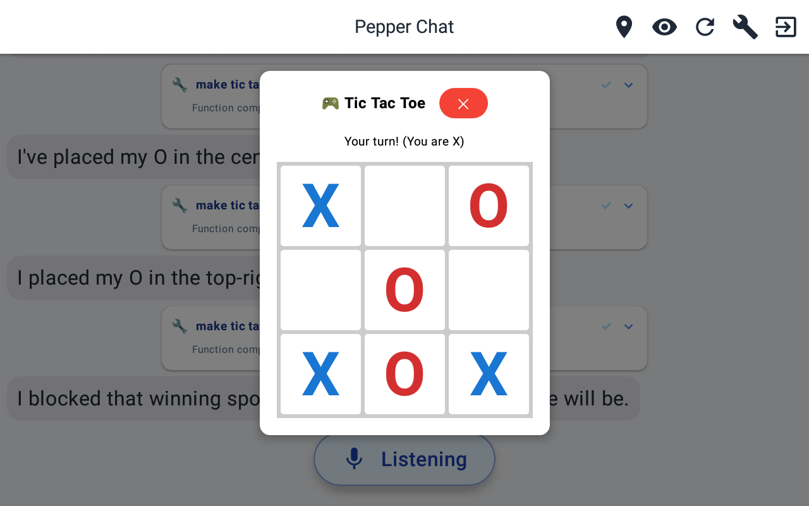
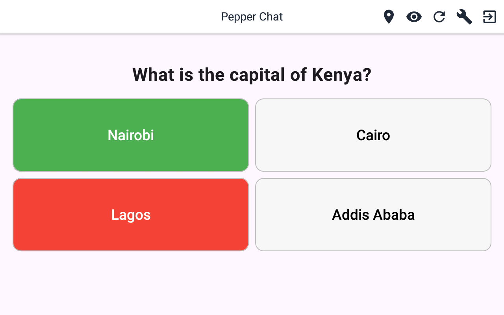
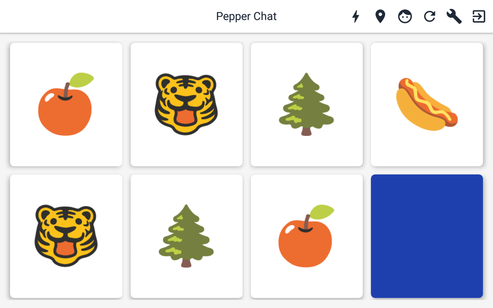

# Pepper Realtime AI Assistant

A multimodal AI system for the Pepper robot powered by OpenAI's Realtime API. It enables natural interactions through voice, touch, vision, and movement, with advanced function calling for robot control (navigation, gestures, animations), information tools (search, weather), and interactive tablet activities (quizzes, memory games, tic-tac-toe).

<p align="center">
  
  <br>
  <em>Pepper robot engaging in natural conversation with advanced AI capabilities</em>
</p>

## 📑 Table of Contents

- [Screenshots](#-screenshots)
- [Features](#-features)
- [Quick Start](#-quick-start)
  - [Requirements](#requirements)
  - [Clone and Configure](#1-clone-and-configure)
  - [Configure API Keys](#2-configure-api-keys)
  - [Build Your Flavor](#3-build-your-flavor)
  - [Open in Android Studio](#4-open-in-android-studio)
  - [Connect to Pepper and Deploy](#5-connect-to-pepper-and-deploy)
  - [Install Standalone Version](#6-install-standalone-version-on-android-device)
- [API Key Setup](#-api-key-setup)
- [Security & Privacy](#-security--privacy)
- [Usage](#-usage)
  - [Basic Operation](#basic-operation)
  - [Available Voice Commands](#available-voice-commands)
  - [Settings Access](#settings-access)
  - [Available Settings](#available-settings)
  - [Customizing the System Prompt](#customizing-the-system-prompt)
- [Core Features & System Capabilities](#core-features)
  - [Voice Input & Language System](#voice-input)
  - [Interruption Handling System](#interruption-handling)
  - [Advanced Chat Interface](#advanced-chat)
  - [Human Perception Dashboard](#human-perception)
  - [Touch Interaction](#touch-interaction)
  - [Navigation Workflow](#navigation-workflow)
  - [Map Visualization](#map-visualization)
  - [Intelligent Obstacle Analysis](#obstacle-analysis)
- [Interactive Entertainment](#interactive-entertainment)
  - [Quiz Game](#quiz-game)
  - [Tic Tac Toe Game](#tic-tac-toe)
  - [Memory Game](#memory-game)
- [Architecture](#-architecture)
- [Development](#-development)
- [Troubleshooting](#-troubleshooting)
- [Contributing](#-contributing)
- [License](#-license)
- [Acknowledgments](#-acknowledgments)

## 📸 Screenshots

<table>
  <tr>
    <td width="33%" valign="top">
      
      <strong>Interactive Function Cards</strong><br>
      Expandable tool execution details with arguments and results
    </td>
    <td width="33%" valign="top">
      
      <strong>Settings Panel</strong><br>
      Configure API providers, system prompt, language settings, audio modes, and feature toggles
    </td>
    <td width="33%" valign="top">
      
      <strong>Navigation Map Overlay</strong><br>
      Real-time map preview with saved locations
    </td>
  </tr>
  <tr>
    <td width="33%" valign="top">
      
      <strong>Human Perception Dashboard</strong><br>
      Real-time human detection with emotions and attention tracking
    </td>
    <td width="33%" valign="top">
      
      <strong>Vision Analysis - Step 1</strong><br>
      Robot looks at ceiling using look_at_position and captures image
    </td>
    <td width="33%" valign="top">
      
      <strong>Vision Analysis - Step 2</strong><br>
      AI analyzes captured image and provides detailed description
    </td>
  </tr>
  <tr>
    <td width="33%" valign="top">
      
      <strong>Tic-Tac-Toe Game</strong><br>
      Voice-controlled Tic-Tac-Toe with visual board
    </td>
    <td width="33%" valign="top">
      
      <strong>Quiz Game</strong><br>
      Voice-controlled quiz with multiple choice answers
    </td>
    <td width="33%" valign="top">
      
      <strong>Memory Game</strong><br>
      Interactive memory card game on tablet
    </td>
  </tr>
</table>

## ✨ Features

- **Dual Build Flavors** - Two app variants for different use cases:
  - **Pepper Flavor** - Full robot integration with QiSDK for Pepper hardware
  - **Standalone Flavor** - Runs on any Android device for testing and development without robot hardware
- **Real-time Voice Chat** - Natural conversations using OpenAI's Realtime API (OpenAI Direct or Azure OpenAI for enhanced privacy) with two audio input modes:
  - **Realtime API audio streaming** - Direct audio input with native voice activity detection
  - **Azure Speech Services STT** - Streaming transcription with superior dialect recognition and confidence scores (warns AI when transcription quality is low)
- **Synchronized Gestures** - Automatic body language during speech output for natural communication
- **Expressive Animations** - Rich library of robot animations triggered by voice commands (wave, bow, applause, kisses, laugh, etc.)
- **Modern Tablet UI** - Clean chat interface with interactive function cards, real-time overlays, and adaptive toolbar
- **Gaze Control** - Precise 3D head/eye positioning with duration control and automatic return
- **Vision Analysis** - Camera-based image understanding and analysis with intelligent obstacle detection
- **Touch Interaction** - Responds to touches on head, hands, and bumpers with contextual AI reactions
- **Navigation & Mapping** - Complete room mapping and autonomous navigation system
- **Human Approach** - Intelligent human detection and approaching
- **Human Perception Dashboard** - Real-time display of detected people with emotions, attention, and distance
- **Azure Face Analysis** - Advanced facial analysis with pose, glasses, mask detection, and image quality assessment
- **Internet Search** - Real-time web search capabilities via Tavily API
- **Weather Information** - Current weather and forecasts via OpenWeatherMap API
- **Interactive Quizzes** - Dynamic quiz generation and interaction
- **Tic Tac Toe Game** - Play against the AI with voice commands and visual board
- **Memory Game** - Card-matching game with multiple difficulty levels

## 🚀 Quick Start

This project supports **two build flavors** to accommodate different use cases:

- **🤖 Pepper Flavor** - Full application with all robot features (navigation, gestures, sensors, robot camera)
- **📱 Standalone Flavor** - Runs on any Android device for testing conversational AI without robot hardware

Both flavors share the same core conversational AI system but differ in hardware integration. The standalone version uses stub implementations for robot-specific features and your device's camera instead of Pepper's camera.

### Requirements

#### For Pepper Robot (Full Functionality)
- **Target Robot**: Pepper v1.8 running NAOqi OS 2.9.5
- **Required IDE**: Android Studio (latest stable version recommended)
- **Build Configuration**:
  - Gradle: `8.13`
  - Android Gradle Plugin: `8.13.0`
  - CompileSdk / TargetSdk: `35`
  - MinSdk: `23` (Android 6.0)
  - Java Version: `17`
- **API Keys**: For full functionality, API keys for various services are required (see "Configure API Keys" section below)

#### For Standalone Mode (Testing on any Android Device)
- **Target Device**: Any Android device running Android 6.0+ (API 23+)
- **IDE**: Android Studio (latest stable version recommended)
- **Build Configuration**: Same as above
- **Purpose**: Test conversational AI, tool system, and generic features without robot hardware
- **Limitations**: Robot-specific features (navigation, gestures, camera, sensors) are simulated with log output

### Modern Development Without the Plugin
This project uses modern Android Studio versions **without** the deprecated Pepper SDK plugin. The plugin is no longer maintained and incompatible with recent Android Studio versions. Instead, we configure the project manually following the approach documented here: **[Pepper with Android Studio in 2024](https://github.com/unitedroboticsgroup-france/MyPepperApplication)**. This enables the use of the latest Android Studio versions, modern AndroidX libraries, Java 17 language features, and the latest Gradle and build tools with improved IDE performance.

**Note on API 23 (Android 6.0) Compatibility:**
Pepper v1.8 runs Android 6.0 (API Level 23). This limits some third-party libraries to older versions, as many newer releases require Android 8.0+ (API 26+) for features like `java.util.Base64` and `MethodHandle`. Despite this constraint, the project uses the latest compatible versions of all dependencies and modern development tools (Gradle 8.13, Java 17, Android Studio latest).

### Setup Steps

1. [Clone and Configure](#1-clone-and-configure)
2. [Configure API Keys](#2-configure-api-keys)
3. [Build Your Flavor](#3-build-your-flavor)
4. [Open in Android Studio](#4-open-in-android-studio)
5. [Connect to Pepper and Deploy](#5-connect-to-pepper-and-deploy) (Pepper) / [Install Standalone Version](#6-install-standalone-version-on-android-device) (Standalone)

### 1. Clone and Configure

**Option A: From ZIP file (Code Submission)**
1. Extract the ZIP file to your desired location
2. Open a terminal in the extracted project directory

**Option B: From Git (when publicly available)**
```bash
git clone https://github.com/[ANONYMIZED]/pepper-realtime-conversation.git
cd pepper-realtime-conversation
```

**Create configuration file:**
- Copy `local.properties.example` to `local.properties` in the project root directory
- **Important:** If you create `local.properties` manually, you must add your Android SDK path at the top:
  ```properties
  sdk.dir=C\:\\Users\\YOUR_USERNAME\\AppData\\Local\\Android\\Sdk
  ```
  (Android Studio adds this automatically when you sync the project)

### 2. Configure API Keys

Edit `local.properties` and add your API keys. See the **[API Key Setup](#-api-key-setup)** section below for detailed instructions on obtaining these keys.

```properties
# REALTIME API PROVIDERS (Choose one or configure both)
OPENAI_API_KEY=your_openai_api_key_here
AZURE_OPENAI_KEY=your_azure_openai_key_here
AZURE_OPENAI_ENDPOINT=your-resource.openai.azure.com

# OPTIONAL: Additional features
AZURE_SPEECH_KEY=your_azure_speech_key_here
AZURE_SPEECH_REGION=your_azure_region
GROQ_API_KEY=your_groq_key_here
TAVILY_API_KEY=your_tavily_key_here
OPENWEATHER_API_KEY=your_weather_key
YOUTUBE_API_KEY=your_youtube_api_key
```

### 3. Build Your Flavor

**🤖 Pepper Flavor (Default)** - Full robot functionality
```bash
# Build for Pepper robot
./gradlew assemblePepperDebug
```
- Includes all robot-specific features (navigation, gestures, camera, sensors)
- Requires Pepper robot hardware
- QiSDK and related dependencies included

**📱 Standalone Flavor** - Testing on any Android device
```bash
# Build for standalone testing
./gradlew assembleStandaloneDebug
```
- Works on any Android device (phone, tablet)
- All generic AI features functional (chat, internet search, quizzes, games, weather)
- **Vision analysis with device camera** - uses front camera for automatic photo capture
- Robot features simulated (movements/gestures logged only)
- Perfect for testing conversational AI and tool system without robot hardware
- Useful for demonstrations and development

**In Android Studio:**
- Select build flavor from: `Build` → `Select Build Variant`
- Choose `pepperDebug` for Pepper robot
- Choose `standaloneDebug` for testing on any device

### 4. Open in Android Studio

1. Open Android Studio (latest stable version)
2. Select **"Open"** and choose the project directory
3. Wait for Gradle sync to complete
4. The project is now ready to build and deploy

### 5. Connect to Pepper and Deploy

#### Step 1: Prepare Pepper
1. Enable **Developer Mode** on Pepper's tablet (Settings → About → Tap "Build number" 7 times)
2. Enable **USB debugging** in Developer Options
3. Ensure Pepper's tablet is connected to the **same WiFi network** as your computer

#### Step 2: Find Pepper's IP Address
1. On Pepper's tablet, swipe down to view **Notifications**
2. Look for the notification showing the IP address (e.g., `192.168.1.100`)
3. Note this IP address under "For Run/Debug Config"

#### Step 3: Connect via ADB
1. Open the **Terminal** in Android Studio (bottom toolbar)
2. Connect to Pepper (replace with Pepper's actual IP):
```bash
   adb connect 192.168.1.100
   ```
3. On Pepper's tablet, an **"Allow USB debugging?"** popup will appear - **Accept** it (may be hidden behind notifications)
4. **Verify connection:**
   ```bash
   adb devices
   # Should show: 192.168.1.100:5555    device
   ```

**⚠️ Connection Troubleshooting:**
- **"Unable to connect"**: Check firewall settings (allow port 5555) or try enabling ADB over TCP:
  ```bash
  # If you have USB access first:
  adb tcpip 5555
  adb connect 192.168.1.100
  ```
- **Device not listed**: Ensure same WiFi network, check IP address, restart ADB server (`adb kill-server && adb start-server`)
- **"Unauthorized"**: Accept the USB debugging popup on Pepper's tablet

#### Step 4: Deploy from Android Studio
1. In Android Studio's toolbar, verify that **"ARTNCORE LPT_200AR"** appears in the device dropdown
2. Click the green **Run button** (▶️) in the toolbar
3. Android Studio will build and install the app on Pepper
4. The app will start automatically on Pepper's tablet

**Note:** The ADB connection persists between sessions. You only need to reconnect if Pepper reboots or changes IP address.

**Alternative: Manual APK Installation**
```bash
# Build the Pepper APK
./gradlew assemblePepperDebug

# Install via ADB (APK path: app/build/outputs/apk/pepper/debug/app-pepper-debug.apk)
adb install -r app/build/outputs/apk/pepper/debug/app-pepper-debug.apk
```

### 6. Install Standalone Version on Android Device

The standalone version allows testing the conversational AI system on any Android phone or tablet without requiring Pepper hardware.

#### Option 1: Via ADB (Recommended)
```bash
# Build the standalone APK
./gradlew assembleStandaloneDebug

# Connect your Android device via USB (USB debugging enabled in Developer Options)
adb devices
# Should show your device ID followed by "device"

# Install the APK (APK path: app/build/outputs/apk/standalone/debug/app-standalone-debug.apk)
adb install -r app/build/outputs/apk/standalone/debug/app-standalone-debug.apk
```

**⚠️ Connection Troubleshooting:**
- **Device not detected**: Install device drivers (manufacturer-specific), enable USB debugging
- **"Unauthorized"**: Accept USB debugging prompt on device, check "Always allow from this computer"
- **USB issues**: Try different USB cable/port, or use Option 2 below

#### Option 2: Manual Transfer (No USB/ADB required)
```bash
# Build the standalone APK
./gradlew assembleStandaloneDebug

# APK location: app/build/outputs/apk/standalone/debug/app-standalone-debug.apk
```

Transfer the APK to your Android device:
- Via cloud storage (Google Drive, OneDrive, etc.)
- Via email attachment  
- Via file transfer (USB in file mode)

On your Android device:
- Enable **"Install from Unknown Sources"** in Settings → Security
- Open the APK file in your file manager
- Tap **"Install"**

#### What Works in Standalone Mode
- ✅ Full conversational AI (Realtime API or Azure Speech)
- ✅ Vision analysis (uses device front camera for automatic photo capture)
- ✅ Internet search, weather, quizzes, games
- ✅ All generic tools and function calling
- ⏸️ Robot movements/gestures (simulated and logged)
- ⏸️ Navigation and mapping (simulated)

**Note:** The app requires camera permission for vision analysis. Grant camera access when prompted.

## 🔑 API Key Setup

### Required APIs (Core Functionality)

**Choose one of the following Realtime API providers:**

#### Option 1: OpenAI Direct (Recommended - Easiest Setup)
1. Go to [platform.openai.com](https://platform.openai.com/)
2. Create an API key
3. That's it! The app supports all Realtime API models:
   - `gpt-realtime` (GA model with built-in vision)
   - `gpt-realtime-mini` (Affordable GA model with built-in vision)
   - `gpt-4o-realtime-preview` (Preview model)
   - `gpt-4o-mini-realtime-preview` (Mini model - significantly lower cost)

#### Option 2: Azure OpenAI (Enterprise Option with Privacy Benefits)
1. Go to [Azure Portal](https://portal.azure.com/)
2. Create an Azure OpenAI resource
3. Deploy one or more of the supported models:
   - `gpt-realtime` (GA model with built-in vision)
   - `gpt-realtime-mini` (Affordable GA model with built-in vision)
   - `gpt-4o-realtime-preview` (Preview model)
   - `gpt-4o-mini-realtime-preview` (Mini model - significantly lower cost)
4. Copy your API key and endpoint

**Privacy & Compliance Advantages:**
- **Data Residency**: Data processed and stored within your chosen Azure region (EU/Switzerland available for GDPR compliance)
- **No Training on Your Data**: Microsoft guarantees that customer data is not used for model training
- **Enterprise Controls**: Role-based access control, encryption at rest and in transit, comprehensive audit logging
- **Compliance**: Supports GDPR, HIPAA, and other regulatory frameworks

### Optional APIs (Extended Features)

#### Azure Speech Services (Optional - for Dialects)
- **Default**: App uses Realtime API for audio input (no separate key needed)
- **Alternative**: Azure Speech for better dialect recognition
- **Setup**: 
1. Go to [Azure Portal](https://portal.azure.com/)
2. Create a Speech Services resource
3. Copy your API key and region
  4. In app: Settings → Audio Input → "Azure Speech (Best for Dialects)"

#### Azure Face API (Advanced Face Analysis - Optional)
- **Free Tier**: 30,000 transactions/month
- **Get Key**: [Azure Portal](https://portal.azure.com/) → Cognitive Services → Face
- **Enables**: Advanced facial analysis, pose detection, glasses/mask detection, image quality assessment
- **Note**: Currently supports detection only; identification features require additional approval

#### Groq API (Vision Analysis - Optional)  
- **Free Tier**: 14,400 requests/day
- **Get Key**: [console.groq.com](https://console.groq.com/)
- **Enables**: Alternative vision analysis provider (gpt-realtime and gpt-realtime-mini have built-in vision, only required for vision analysis with gpt-4o-realtime-preview and gpt-4o-mini-realtime-preview)

#### Tavily API (Internet Search)
- **Free Tier**: 1,000 searches/month
- **Get Key**: [tavily.com](https://tavily.com/)
- **Enables**: Real-time web search

#### OpenWeatherMap API (Weather)
- **Free Tier**: 1,000 calls/day
- **Get Key**: [openweathermap.org/api](https://openweathermap.org/api)
- **Enables**: Weather information and forecasts

#### YouTube Data API (Video Playback)
- **Free Tier**: 10,000 requests/day
- **Get Key**: [console.cloud.google.com](https://console.cloud.google.com/)
- **Enables**: Video search and playback in popup window

## 🔒 Security & Privacy

### API Key Security
**⚠️ Development vs. Production:**
- Current implementation stores API keys in `BuildConfig` (compiled into APK) - convenient for development but **not secure for production**
- Keys are accessible via APK decompilation
- **For production:** Use runtime entry with `EncryptedSharedPreferences` or proxy API calls through your backend server

### Data Privacy
This app sends data to third-party services when features are used:
- **OpenAI/Azure (Realtime API)**: Audio, messages, images, tool results
- **Azure Speech** (optional): Audio for transcription
- **Azure Face** (optional): Camera images for facial analysis - ⚠️ **requires GDPR/CCPA consent for biometric data**
- **Groq/Tavily/OpenWeather/YouTube** (optional): Search queries, images, location data

**To disable optional features:** Leave corresponding API keys empty in `local.properties` (or remove if already entered), or use Settings → Audio Input to switch modes.

**Camera & Biometric Consent:**
- Pepper (robot camera) / Standalone (front camera) used for vision analysis
- Face analysis processes biometric data - **explicit user consent required** under GDPR/CCPA/BIPA
- **To disable:** Leave `GROQ_API_KEY` and `AZURE_FACE_API_KEY` empty (or remove/revoke camera permission)

**Local Storage:** Chat history and maps stored locally; clear via "New Chat" button or Android Settings → Clear Data.

## 🎯 Usage

### Basic Operation
1. **Launch** the app on your Pepper robot
2. **Wait** for "Ready" status
3. **Speak** naturally to start conversation
4. **Tap** status bar to interrupt during robot speech
5. **Tap** dashboard symbol in status bar to toggle Human Perception Dashboard overlay
6. **Touch** robot's head, hands, or bumpers for physical interaction
7. **Tap** navigation icon (📍) in toolbar to show/hide the map preview with saved locations
8. **Tap** function call cards in chat to view detailed arguments and results
9. **Tap** vision analysis photos in chat to view them in full-screen overlay

### Available Voice Commands

#### Basic Interaction
- **"What do you see?"** - Triggers vision analysis (uses gpt-realtime or Groq API)
- **"What time is it?"** or **"What's the date?"** - Gets current date and time information
- **"What's the weather like?"** - Gets weather information (requires OpenWeather API)
- **"Search for [topic]"** - Performs internet search (requires Tavily API)
- **"Play [song/video]"** - Searches and plays YouTube videos (requires YouTube API)
- **"Tell me a joke"** - Random joke from local database
- **"Show me [animation]"** - Plays Pepper animations (hello/wave, bow, applause, kisses, laugh, happy, etc.)
- **"Start a Tic Tac Toe game"** - Opens the game dialog for voice-controlled gameplay

#### Movement Commands
- **"Move [distance] [direction]"** - Basic movement in any direction (0.1-4.0m)
  - *"Move 2 meters forward"* - Simple forward movement
  - *"Move 1 meter forward and 2 meters right"* - Combined diagonal movement
  - *"Move 0.5 meters backward and 1 meter left"* - Combined movement in any direction
- **"Turn [direction] [degrees]"** - Rotate in place (left/right, 15-180 degrees)
- **"Approach him/her"** - Intelligently approach a detected person for interaction
- **"Come to me"** - Alternative command to approach the user

#### Gaze Control
- **"Look at [target]"** - Directs Pepper's gaze towards a specific 3D position relative to robot base
  - *"Look at the ground in front of you"* - AI calculates coordinates (1.0, 0.0, 0.0)
  - *"Look up at the ceiling"* - AI calculates coordinates (0.0, 0.0, 2.5)
  - *"Look two meters to your left and one meter up"* - AI calculates coordinates (0.0, 2.0, 1.0)
  - *"Look at the ground one meter ahead for 5 seconds"* - Duration control with auto-return
- **Perfect for Vision Analysis** - *"What do you see one meter in front of you on the ground?"*
  - AI automatically: 1) Looks at position 2) Captures image 3) Analyzes vision 4) Returns gaze

#### Navigation & Mapping
- **"Create a map"** - Start mapping the current environment
- **"Move forward 2 meters"** - Guide Pepper during mapping
- **"Save this location as [name]"** - Save current position with a name
- **"Finish the map"** - Complete and save the environment map
- **"Go to [location]"** - Navigate to any saved location
- **"Navigate to [location]"** - Alternative navigation command

### Settings Access
- **Tap the wrench icon** (🔧) in the top-right toolbar or **swipe from right edge** to access settings drawer

### Available Settings
- **API Provider** - Choose between OpenAI Direct and Azure OpenAI
- **Model Selection** - Select from gpt-realtime, gpt-realtime-mini, gpt-4o-realtime-preview, or gpt-4o-mini-realtime-preview
- **Voice Selection** - Choose from 10 available voices (alloy, ash, ballad, cedar, coral, echo, marin, sage, shimmer, verse)
- **Audio Input Mode** - Switch between Realtime API audio streaming and Azure Speech Services STT
- **System Prompt** - Customize the AI's personality and behavior instructions
- **Recognition Language** - Set speech recognition language (German, English, French, Italian variants)
- **Temperature** - Adjust AI creativity/randomness (0-100%)
- **Volume Control** - Set audio output volume
- **Silence Timeout** - Configure required silence duration for speech recognition completion
- **Tool Management** - Enable/disable specific function tools (vision, weather, search, games, etc.)
- **ASR Confidence Threshold** - Set minimum confidence level for speech recognition acceptance

#### API Provider Selection
You can switch between different Realtime API providers in the settings:

- **OpenAI Direct** (Recommended): Supports all four models (`gpt-realtime`, `gpt-realtime-mini`, `gpt-4o-realtime-preview`, `gpt-4o-mini-realtime-preview`) directly from OpenAI
- **Azure OpenAI** (Enterprise): Supports all four models (`gpt-realtime`, `gpt-realtime-mini`, `gpt-4o-realtime-preview`, `gpt-4o-mini-realtime-preview`) with your Azure deployment

**Note**: Changing the API provider, model, voice, or audio input mode will restart the session automatically.

### Customizing the System Prompt

The default system prompt is optimized following OpenAI's [Realtime API Prompting Guide](https://cookbook.openai.com/examples/realtime_prompting_guide). It includes:

- **Structured sections** - Role, Personality, Tools, Instructions for better model understanding
- **Sample phrases** - Consistent greetings, acknowledgments, and closings
- **Variety rules** - Prevents repetitive responses ("I see" | "Got it" | "Understood")
- **Tool integration** - Natural tool usage without explicit announcements
- **Physical embodiment** - First-person perspective as the robot

**To customize:**
1. Edit the system prompt in `app/src/main/res/values/strings.xml` (search for `default_system_prompt`)
2. Or modify it dynamically in Settings → System Prompt within the app
3. Follow the [Realtime Prompting Guide](https://cookbook.openai.com/examples/realtime_prompting_guide) for best practices

**Key tips from the guide:**
- Use bullets over paragraphs for clarity
- Guide with specific examples
- Capitalize important rules for emphasis
- Add conversation flow states for complex interactions

<a id="core-features"></a>
## ⚙️ Core Features & System Capabilities

<a id="voice-input"></a>
## 🎙️ Voice Input & Language System

The app provides comprehensive voice input and multilingual capabilities with two speech recognition modes and intelligent language handling.

### Audio Input Modes

The app supports **two speech recognition modes**, configurable in **Settings → Audio Input**:

#### 1. Realtime API Audio (Default) ✨
- **Simple Setup** - No separate speech API key needed
- **Lower Latency** - Integrated audio processing with conversation flow
- **Server VAD** - Automatic speech detection handled by the model
- **Async Transcripts** - User speech transcripts appear after responses start
- **Direct Audio Processing** - Model processes audio directly for responses
- **Note**: The displayed transcript may not exactly match what the model understood, as transcription is generated asynchronously
- **Best For** - English and major languages, quick setup

#### 2. Azure Speech Services (Recommended for some low resource languages)
- **Superior Quality** - Significantly better for regional dialects and low-resource languages
- **Continuous Recognition** - For optimal latency, transcription happens while speaking (not after), with interim results displayed in status bar
- **Confidence Scores** - Real-time feedback on transcription quality
- **Specialized Models** - Language-specific optimization for regional variants
- **Sync Transcripts** - User speech appears immediately in chat
- **Full Transparency** - The exact transcribed text is sent to the model (what you see = what the model receives)
- **Azure VAD** - Voice activity detection handled by Azure Speech Services
- **Configurable Silence Timeout** - End-of-speech detection after silence (default: 500ms, adjustable in settings)
- **Requires** - `AZURE_SPEECH_KEY` in `local.properties`
- **Best For** - Some low-resource languages, production use, debugging

#### Switching Audio Modes
1. Open app **Settings** (tap wrench icon 🔧 in toolbar or swipe from right edge)
2. Select **Audio Input** dropdown
3. Choose preferred mode:
   - **"Realtime API (Simple Setup)"** - Default, no extra keys
   - **"Azure Speech (Best for Dialects)"** - Requires Azure Speech key
4. Close settings - change takes effect immediately

### ASR Confidence System

**Note**: Only available in **Azure Speech mode**. The app uses intelligent confidence scoring to ensure accurate voice input processing.

#### How It Works
- **Confidence Analysis** - Each recognized speech gets a confidence score (0-100%)
- **Smart Tagging** - Speech below the configured threshold gets tagged with "[Low confidence: XX%]"
- **AI Model Awareness** - The AI can identify uncertain transcriptions and ask for clarification
- **Adjustable Settings** - Users can customize the minimum confidence level in settings (default: 70%)

#### Benefits
- **Intelligent Clarification** - AI can ask "Did you say X?" or "Can you repeat?" when transcription is uncertain
- **Context Awareness** - AI knows when to be more careful about interpreting unclear speech
- **Customizable Sensitivity** - Users can adjust based on their environment and speaking style  
- **Better Understanding** - AI can handle ambiguous transcriptions more gracefully

### Multilingual Support

#### AI Response Languages
- **Universal Language Support** - The Realtime API can respond in any language, including regional dialects
- **Instant Language Switching** - The AI can switch languages mid-conversation when requested by the user or specified in the system prompt
- **Contextual Language Use** - AI automatically adapts to the user's preferred language based on conversation context

#### Speech Recognition Languages

The app supports **30+ languages** in both audio input modes:

**Realtime API Mode:**
- Language setting affects the **input audio transcription** (Whisper-based) that appears in chat
- Does NOT affect what the model understands (model processes audio directly with automatic language detection)
- Transcription quality improves when correct language is configured

**Azure Speech Mode:**
- Language setting is **critical** - directly affects what text is sent to the model
- Must match the spoken language for accurate recognition

**Supported languages** (both modes):

- **German variants**: de-DE (Germany), de-AT (Austria), de-CH (Switzerland)
- **English variants**: en-US, en-GB, en-AU, en-CA
- **French variants**: fr-FR (France), fr-CA (Canada), fr-CH (Switzerland)
- **Italian variants**: it-IT (Italy), it-CH (Switzerland)
- **Spanish variants**: es-ES (Spain), es-AR (Argentina), es-MX (Mexico)
- **Portuguese variants**: pt-BR (Brazil), pt-PT (Portugal)
- **Chinese variants**: zh-CN (Mandarin Simplified), zh-HK (Cantonese Traditional), zh-TW (Taiwanese Mandarin)
- **Asian languages**: ja-JP (Japanese), ko-KR (Korean)
- **European languages**: nl-NL (Dutch), nb-NO (Norwegian), sv-SE (Swedish), da-DK (Danish)
- **Other languages**: ru-RU (Russian), ar-AE/ar-SA (Arabic)

#### Language Configuration
- **Settings Control** - Recognition language can be changed in app settings
- **Live Switching** - Language changes take effect immediately during active sessions
- **No App Restart** - System reconfigures automatically

#### Important Language Considerations

**Realtime API Mode:**
- ✅ Model understands speech via automatic language detection (no configuration required)
- ⚙️ Language setting improves displayed **transcript quality** (Whisper-based)
- 💡 Recommendation: Configure correct language for better transcripts, but not strictly necessary

**Azure Speech Mode:**
- ⚠️ Language setting is **critical** - must match spoken language
- Users must speak in the configured recognition language for accurate transcription
- If user speaks in different language than configured, recognition will fail or be very poor
- 💡 Recommendation: Always change language setting before switching spoken languages

**AI Response Language:**
- ✅ AI can respond in any language regardless of input mode or language setting

#### Usage Examples
```bash
# System prompt in English, but AI can respond in other languages when requested
User (English): "Please respond in German from now on"
AI (German): "Gerne! Ab jetzt spreche ich auf Deutsch mit dir."

# User must change recognition language in settings to speak German
User: (Changes settings to de-DE, then speaks German)
"Erzähl mir einen Witz"
AI: "Gerne! Hier ist ein Witz für dich..."
```

<a id="interruption-handling"></a>
## 🎛️ Interruption Handling System

Due to Pepper's hardware limitations (no echo cancellation), the app uses an intelligent microphone management system to prevent the robot from hearing itself while ensuring users can still interrupt ongoing responses.

### Microphone Management
- **Closed During Speech** - Microphone automatically closes when Pepper is speaking or processing
- **Open During Listening** - Microphone only active when waiting for user input
- **Hardware Constraint** - Necessary because Pepper's older hardware lacks echo cancellation

### Status Bar Interruption Controls
- **First Tap** (during robot speech) - Immediately stops current response, clears audio queue, cancels generation, AND mutes microphone ("Muted — tap to unmute" status)
- **Second Tap** (when muted) - Unmutes and returns to listening mode

### Automatic Response Interruption
Certain events automatically interrupt ongoing responses to provide immediate feedback:
- **Touch Events** - Physical touch triggers new contextual response
- **Navigation Updates** - Status messages like "[MAP LOADED]" or "[NAVIGATION ERROR]"
- **Game Events** - Memory game matches, quiz answers, etc.
- **System Messages** - Tool execution results and status updates

### Technical Features
- **Instant Stop** - Responses halt immediately when interrupted
- **Queue Management** - Audio buffers cleared to prevent delayed playback
- **State Coordination** - Turn management ensures proper microphone timing
- **Seamless Recovery** - Smooth transition back to listening mode

<a id="advanced-chat"></a>
## 💬 Advanced Chat Interface

### Function Call Transparency
The chat interface provides **complete transparency** into AI function calling with professional expandable UI elements.

### Function Call Cards
- **Expandable Design** - Each function call appears as a collapsible card in the chat
- **Status Indicators** - Visual status with ✅ (completed) or ⏳ (pending) icons
- **Function Icons** - Unique emoji icons for each tool (🌐 search, 🌤️ weather, 👁️ vision, etc.)
- **Summary View** - Condensed description when collapsed
- **Detailed View** - Full arguments and results when expanded

### Interactive Elements
- **Tap to Expand** - Click any function call card to toggle detailed view
- **Smooth Animations** - Professional rotate animations for expand/collapse arrows  
- **JSON Formatting** - Properly formatted and readable JSON for arguments and results
- **Real-time Updates** - Function result appears automatically when operation completes

### Transparency Benefits
- **Debugging Aid** - See exactly what parameters were sent to each function
- **Result Verification** - View complete API responses and tool outputs
- **Learning Tool** - Understand how AI decides to use different functions
- **Trust Building** - Complete visibility into AI decision-making process

### Vision Photo Display
When vision analysis is performed, photos are automatically displayed in the chat with interactive features.

### Photo Integration
- **Automatic Capture** - Photos appear immediately when vision analysis starts
- **Thumbnail View** - Compact 220dp preview images in chat flow
- **Quality Optimization** - Efficiently sized thumbnails for smooth scrolling
- **Context Placement** - Photos appear exactly where vision analysis was requested

### Full-Screen Viewing
- **Tap to Expand** - Click any photo thumbnail to view in full-screen overlay
- **High Resolution** - Full overlay displays up to 1024x1024 resolution
- **Overlay Interface** - Clean, distraction-free viewing experience  
- **Easy Dismissal** - Tap anywhere on overlay to return to chat

### Professional Features
- **Session Management** - Photos are cleaned up automatically when session ends
- **Memory Optimization** - Efficient bitmap handling prevents memory leaks
- **File Path Storage** - Photos remain accessible throughout the conversation
- **Seamless Integration** - Photos and function calls work together in chat flow

<a id="human-perception"></a>
## 👁️ Human Perception Dashboard

### Overview
The Human Perception Dashboard provides real-time visualization of all detected people around Pepper, displaying comprehensive information about each person's state and engagement level.

### How to Access
- **Tap the dashboard symbol** in the status bar to toggle the dashboard overlay
- **Dashboard appears** in the top-right corner as a floating overlay
- **Tap close button** (×) or dashboard symbol again to hide

### Displayed Information
For each detected person, the dashboard shows:

#### Basic Information
- **Person ID** - Unique identifier for tracking
- **Distance** - Real-time distance measurement in meters
- **Estimated Age** - Age estimation from Pepper's perception
- **Gender** - Gender classification

#### Emotional & Engagement Data
- **Attention State** - Whether person is looking at robot, elsewhere, or up
- **Engagement Level** - How interested the person appears
- **Pleasure State** - Emotional pleasure/displeasure level
- **Excitement State** - Energy and excitement level
- **Smile Detection** - Current smile state
- **Basic Emotion** - Primary detected emotion

#### Azure Face Analysis (when API key provided)
- **Head Pose** - Yaw, pitch, and roll angles in degrees
- **Glasses Detection** - No glasses, reading glasses, or sunglasses
- **Mask Detection** - Whether person is wearing a face mask
- **Image Quality** - Low, medium, or high quality assessment
- **Blur Level** - Numerical blur measurement (0-1 scale)
- **Exposure Level** - Under-exposed, good exposure, or over-exposed

#### Advanced Features
- **Live Updates** - Information refreshes every 1.5 seconds
- **Face Pictures** - Small profile images when available
- **Comprehensive Tracking** - Maintains data as people move around
- **Clean Interface** - Organized table view with clear headers
- **Intelligent Face Analysis** - Analyzes faces when new people detected or every 10 seconds
- **Rate Limit Handling** - Graceful degradation when Azure API limits reached

### Use Cases
- **Social Interaction** - Understand who's interested in engaging
- **Approach Decisions** - See which person to approach first
- **Group Dynamics** - Monitor multiple people simultaneously
- **Debugging** - Verify human detection accuracy
- **Research** - Study human-robot interaction patterns

### Technical Details
- **QiSDK Integration** - Uses Pepper's built-in human awareness
- **Real-time Processing** - Efficient polling system (1.5s intervals)
- **Resource Management** - Automatically stops monitoring when hidden
- **Thread-Safe** - Handles concurrent data updates safely

<a id="touch-interaction"></a>
## 👋 Touch Interaction

Pepper responds to physical touch on various sensors. When touched, the AI receives context and can respond naturally in conversation.

### Available Touch Sensors
- **🧠 Head Touch** - Touch the top of Pepper's head
- **🤲 Hand Touch** - Touch either left or right hand  
- **⚡ Bumper Sensors** - Front left, front right, and back bumper sensors

### Features
- **Contextual AI Integration** - Touch events like "[User touched my head]" are sent to AI for natural responses
- **Debounce Protection** - 500ms delay prevents multiple rapid touches
- **Smart Pausing** - Automatically pauses during navigation/localization

<a id="navigation-workflow"></a>
## 🗺️ Navigation Workflow

### Complete Setup Process

#### 1. Create Environment Map
```bash
User: "Create a map of this room"
Robot: "I have started mapping. I have cleared 3 existing locations (printer, kitchen, entrance) since they would be invalid with the new map coordinate system. Guide me through the room..."
```

**Note**: Creating a new map automatically deletes all existing saved locations since they become invalid with the new coordinate system.

#### 2. Guide Pepper Through the Room
```bash
User: "Move forward 2 meters"
User: "Turn right 90 degrees"  
User: "Move forward 1 meter"
# Continue exploring all areas you want mapped
```

#### 3. Save Important Locations
```bash
User: "Save this location as printer"
Robot: "Saved location 'printer' with high precision during mapping"

User: "Save this location as kitchen" 
Robot: "Saved location 'kitchen' with high precision during mapping"
```

#### 4. Finish Mapping
```bash
User: "Finish the map"
Robot: "Map completed and saved successfully. Ready for navigation!"
```

**⚠️ Important**: Pepper should be at the **same position** where mapping was started when finishing the map. This ensures accurate localization.

#### 5. Navigate to Saved Locations
```bash
User: "Go to the printer"
Robot: "Navigating to printer... I have arrived at printer."

User: "Navigate to kitchen"
Robot: "Navigating to kitchen (high-precision location)..."
```

### Smart Location Recognition
The AI automatically knows all available locations and can suggest corrections:

```bash
User: "Go to dorm"
Robot: "I have these locations: Door, Kitchen, Printer. Did you mean 'Door'?"

User: "Yes, door" 
Robot: "Navigating to door..."
```

### Key Features
- **🎯 High-Precision Locations**: Saved during mapping for maximum accuracy
- **🧠 Intelligent Suggestions**: AI suggests similar location names
- **📍 Persistent Storage**: Locations survive app restarts within the same map
- **⚡ Dynamic Updates**: AI knows new locations immediately
- **🛡️ Error Prevention**: No "location not found" errors
- **🗑️ Auto-Cleanup**: New maps automatically clear old locations to prevent confusion

### Localization Best Practices
**⚠️ Critical for Successful Localization:**
- When **finishing a map**: Pepper should be at the same position where mapping started
- When **loading a saved map** (after app restart): Place Pepper at the same starting position as when the map was created
- If Pepper is not at the starting position during localization, orientation may fail or take significantly longer
- The starting position serves as the reference point for the entire coordinate system

### Map Visualization

#### Map Preview Overlay
The app provides a **visual map preview** that shows the created environment map along with all saved locations in real-time.

#### How to Access
- **Tap the navigation icon** (📍) in the top toolbar to toggle the map preview
- **Overlay appears** in the top-right corner as a 320x240dp floating window
- **Tap again** to hide the preview

#### Visual Features
- **Environment Map** - Shows the actual mapped room layout as generated by Pepper's sensors
- **Saved Locations** - Displays all saved locations as **cyan-colored markers** with labels
- **Real-time Status** - Shows current navigation state:
  - *"No Map Available"* - No map has been created yet
  - *"Localizing..."* - Pepper is determining its position within the map
  - *"Map Loaded"* - Map is ready but robot not yet localized
  - *"Map Ready - No Locations"* - Map active but no locations saved
  - *Live view* - When localized, shows map with location markers

#### Use Cases
- **Location Overview** - See all saved locations at a glance
- **Navigation Planning** - Visually plan which locations to navigate to
- **Map Verification** - Confirm the mapped area covers desired spaces
- **Location Management** - Visual feedback when saving new locations
- **Debugging** - Verify mapping and localization status

#### Technical Details
- **Custom MapPreviewView** - Purpose-built Android custom view component
- **QiSDK Integration** - Uses Pepper's native map bitmap generation
- **Dynamic Updates** - Automatically refreshes when locations are added/removed
- **Optimized Rendering** - Efficient drawing with proper scaling and anti-aliasing

<a id="obstacle-analysis"></a>
## 🔍 Intelligent Obstacle Analysis

When Pepper's movement is blocked, the AI automatically analyzes what's in the way:

```bash
User: "Move forward 2 meters"
Robot: "Something is blocking my path. Let me see what it is..."
# AI automatically: look_at_position → analyze_vision → return gaze
Robot: "I can see a chair blocking my path. Should I try moving around it?"
```

**Key Features:**
- **🎯 Automatic Activation** - Triggers when movement fails due to obstacles
- **📍 Smart Analysis** - Looks forward and captures obstacle image automatically  
- **🔄 No Manual Commands** - User doesn't need to ask "what do you see?"

<a id="interactive-entertainment"></a>
## 🎮 Interactive Entertainment

The app offers multiple interactive games and activities that can be started through voice commands or direct interaction.

<a id="quiz-game"></a>
### 🎯 Quiz Game
- **Voice-Activated** - Start with "Let's play a quiz" or "Start a quiz game"
- **Dynamic Questions** - AI generates quiz questions on various topics
- **Multiple Choice** - Interactive answer selection with visual feedback
- **Score Tracking** - Real-time score display and progress tracking
- **Educational & Fun** - Combines learning with entertainment

<a id="tic-tac-toe"></a>
### 🎮 Tic Tac Toe Game

#### How to Play
The AI opponent provides an interactive Tic Tac Toe experience with voice commands and visual feedback.

#### Starting a Game
```bash
User: "Let's play Tic Tac Toe"
Robot: "Great! Let's start a game of Tic Tac Toe. You are X, I am O."
# Game dialog opens automatically
```

#### Gameplay
- **Visual Board**: 3x3 grid with clear X and O markers
- **Touch & Voice**: Make moves by tapping board positions
- **AI Opponent**: Intelligent moves via Realtime API
- **Real-time Updates**: Instant visual and voice feedback

#### Game Flow
1. **User starts** as X (always goes first)
2. **Tap any position** on the board to make your move
3. **AI responds** with voice feedback and makes its move as O
4. **Continue alternating** until someone wins or draws
5. **Game auto-closes** after 5 seconds when finished

#### Voice Integration
- All moves trigger context updates to the AI
- AI provides natural commentary and reactions
- Game state communicated through existing WebSocket connection
- Seamless integration with ongoing conversation

#### Game Features
- **🎯 Smart AI**: Competitive gameplay with strategic moves
- **🎨 Clean UI**: Large, clear buttons with distinct X/O markers
- **🔊 Voice Feedback**: Natural AI commentary during gameplay
- **⚡ Fast Response**: Immediate visual updates and AI reactions
- **🎪 Auto-Close**: Game closes automatically when finished
- **🔄 Repeatable**: Start new games anytime with voice commands

<a id="memory-game"></a>
### 🧠 Memory Game

#### How to Play
The Memory Game provides a classic card-matching experience with customizable difficulty levels.

#### Starting a Game
```bash
User: "Let's play a memory game"
Robot: "Starting memory game! Find matching pairs by flipping two cards."
# Memory game dialog opens with card grid
```

#### Gameplay
- **Card Grid**: Face-down cards arranged in a grid pattern
- **Match Pairs**: Flip two cards at a time to find matching symbols
- **Visual Feedback**: Cards show colorful emojis when flipped
- **Progress Tracking**: Live counter shows moves and matched pairs

#### Difficulty Levels
1. **Easy**: 4 pairs (8 cards) - Perfect for beginners
2. **Medium**: 8 pairs (16 cards) - Balanced challenge
3. **Hard**: 12 pairs (24 cards) - Memory expert level

#### Game Flow
1. **Choose difficulty** when starting (defaults to medium)
2. **Tap cards** to flip them and reveal symbols
3. **Find matching pairs** - matched cards stay face-up
4. **Complete the game** when all pairs are found
5. **View stats** showing total moves and completion time

#### Memory Game Features
- **🎨 Rich Symbols**: Over 80 different emojis (animals, food, objects, etc.)
- **⏱️ Timer**: Live timer tracks your completion time
- **📊 Statistics**: Move counter and pairs remaining
- **🔄 Randomization**: Different symbol combinations each game
- **📱 Touch Interface**: Responsive card flipping animations

## 🏗️ Architecture

### Key Features
- **Lazy Validation** - API keys only checked when features are used
- **Graceful Degradation** - Missing keys don't break core functionality
- **Dynamic Registration** - Only available tools are registered with AI
- **Clean Separation** - Core and optional features are independent

### System Architecture

```
┌─────────────────────────────────────────────────────────────────────┐
│                          ChatActivity                                │
│                     (Main UI & Lifecycle)                            │
└──────────────┬──────────────────────────────────────┬───────────────┘
               │                                       │
               │                                       │
       ┌───────▼────────┐                     ┌───────▼────────┐
       │ RealtimeSession│                     │  RobotLifecycle│
       │    Manager     │                     │     Bridge     │
       │  (WebSocket)   │                     │   (Flavor)     │
       └───────┬────────┘                     └───────┬────────┘
               │                                       │
               │                                       │
       ┌───────▼────────┐                     ┌───────▼────────┐
       │  RealtimeEvent │                     │ RobotController│
       │    Handler     │◄────────────────────┤   (Flavor)     │
       └───────┬────────┘                     └───────┬────────┘
               │                                       │
               │                                       │
       ┌───────▼────────────────────────────────┐     │
       │         ToolRegistry                   │     │
       │  (Dynamic Tool Registration)           │     │
       └───────┬────────────────────────────────┘     │
               │                                       │
               │                                       │
       ┌───────▼────────────────────────────────┐     │
       │         ToolContext                    │     │
       │  (Execution Environment)               │◄────┘
       └───────┬────────────────────────────────┘
               │
               │
       ┌───────▼────────────────────────────────┐
       │            Tool Layer                  │
       ├────────────────────────────────────────┤
       │  Vision  │  Movement  │  Navigation    │
       │  Gesture │  Face API  │  Internet      │
       │  Weather │  Games     │  ...           │
       └────────────────────────────────────────┘
               │
               │
       ┌───────▼────────────────────────────────┐
       │      Hardware/Service Adapters         │
       ├────────────────────────────────────────┤
       │  Pepper: QiSDK, Robot Camera           │
       │  Standalone: Device Camera, Stubs      │
       └────────────────────────────────────────┘
```

**Flavor-Based Abstraction:**
- **Pepper Flavor**: Uses QiSDK, robot sensors, navigation
- **Standalone Flavor**: Uses device camera, simulates robot features

### Voice Request Data Flow

```
1. User Speaks
   │
   ▼
┌─────────────────────────────────────────────────────────────┐
│             Audio Input Mode Selection                      │
├─────────────────────────────┬───────────────────────────────┤
│   Mode A: Realtime API      │   Mode B: Azure Speech STT    │
│   (Default - Simple)        │   (Better for Dialects)       │
└──────────┬──────────────────┴───────────┬──────────────────┘
           │                               │
           │ Audio Stream                  │ Audio Stream
           ▼                               ▼
    ┌─────────────┐                 ┌──────────────┐
    │  Realtime   │                 │ Azure Speech │
    │   API WS    │                 │   Service    │
    │  (Server    │                 │    (STT)     │
    │    VAD)     │                 └──────┬───────┘
    └─────┬───────┘                        │
          │                                │ Transcript
          │ Audio + Transcript             │
          │                                │
          └────────────┬───────────────────┘
                       │
                       ▼
              ┌────────────────┐
              │  Realtime API  │
              │   WebSocket    │
              │ (Model: gpt-   │
              │  realtime or   │
              │  4o variants)  │
              └────────┬───────┘
                       │
                       │ Response Events
                       │
              ┌────────▼─────────────────────────────┐
              │    RealtimeEvent Handler             │
              │  (Process response events)           │
              └────┬─────────────────────┬───────────┘
                   │                     │
                   │                     │
      ┌────────────▼─────────┐   ┌──────▼──────────────┐
      │ response.audio.delta │   │ response.function_  │
      │   (Direct Answer)    │   │  call_arguments.    │
      │                      │   │      delta          │
      │ No tool needed -     │   │                     │
      │ AI responds directly │   │  (Tool Call)        │
      └────────┬─────────────┘   └──────┬──────────────┘
               │                        │
               │                        ▼
               │               ┌─────────────────┐
               │               │  ToolRegistry   │
               │               │   & Context     │
               │               └────────┬────────┘
               │                        │
               │                        │ Execute Tool
               │                        ▼
               │          ┌─────────────────────────────┐
               │          │     Tool Execution          │
               │          ├─────────────────────────────┤
               │          │ • Vision: Capture + Analyze │
               │          │ • Movement: Move/Turn       │
               │          │ • Gesture: Play Animation   │
               │          │ • Search: Query Internet    │
               │          │ • Navigation: Go to location│
               │          └────────┬────────────────────┘
               │                   │
               │                   │ Result
               │                   ▼
               │          ┌─────────────────┐
               │          │ conversation.   │
               │          │   item.create   │
               │          │ (Tool Output)   │
               │          └────────┬────────┘
               │                   │
               │                   ▼
               │          ┌─────────────────┐
               │          │  Realtime API   │
               │          │   Processes     │
               │          │   Tool Result   │
               │          └────────┬────────┘
               │                   │
               └───────────────────┘
                       │
                       │ response.audio.delta
                       ▼
         ┌─────────────────┐
         │  Audio Player   │
         │  (TTS Output)   │
         └────────┬────────┘
                  │
                  ▼
         ┌─────────────────┐
         │  Synchronized   │
         │    Gestures     │
         │  (If available) │
         └─────────────────┘
                  │
                  ▼
              User Hears
```

**Key Flow Characteristics:**
- **Model Flexibility**: Supports gpt-realtime (GA), gpt-realtime-mini, gpt-4o-realtime-preview, gpt-4o-mini-realtime-preview
- **Dual Audio Input**: Realtime API (simple) or Azure Speech (dialect quality)
- **Server-side VAD**: Realtime API handles turn detection automatically
- **Conditional Tool Calls**: AI decides when tools are needed (not every response uses tools)
- **Direct Responses**: Simple queries get immediate audio responses without tool execution
- **Streaming Function Calls**: Tool call deltas assembled in real-time when needed
- **Synchronous Execution**: Tools run immediately, results sent back
- **Audio Streaming**: TTS audio played as it arrives (low latency)
- **Gesture Coordination**: Animations triggered alongside speech

## 🛠️ Development

### SDK Architecture & Extensibility

This application makes extensive use of **Pepper Android SDK (QiSDK)** high-level functions for robot control, navigation, perception, and interaction. The QiSDK provides a modern, Java-based API that integrates seamlessly with Android development.

#### SDK Limitations & Extension Possibilities

**QiSDK Limitations:**
- Limited to high-level abstractions (navigation, gestures, perception)
- No direct access to low-level robot functions available in the older NAOqi SDK
- Some advanced robot capabilities (e.g., low-level motor control, direct sensor access) are not exposed

**Extension via SSH:**
- The app performs an **SSH connection test** to the robot's head at startup
- This SSH connection provides a path for developers to access **low-level NAOqi functions** if needed
- Developers can extend the app with custom SSH-based commands to:
  - Access sensors not exposed in QiSDK
  - Implement low-level motor control
  - Integrate custom NAOqi modules
  - Debug and monitor system-level robot state

**Development Approach:**
- **Primary**: Use QiSDK high-level functions for all standard features (recommended for stability and maintainability)
- **Advanced**: Use SSH/NAOqi for specialized low-level requirements when QiSDK is insufficient

This hybrid approach provides both the convenience of modern Android development and the flexibility of low-level robot access when needed.

### Gesture Synchronization During Speech

**Challenge:**
When using external TTS audio (Realtime API or Azure Speech), Pepper's built-in gesture generation system does not activate automatically. The robot's native TTS system typically generates synchronized gestures, but this integration is lost when streaming audio from external sources.

**Solution:**
The app implements a **gesture animation loop** that runs during speech output:
- **Random Explanatory Gestures**: A selection of appropriate "explaining" gestures (body talk animations) are played in a continuous loop
- **Duration-Based**: Gestures run for the entire duration of the audio playback
- **Natural Movement**: Creates the impression of natural communication through continuous body language
- **Non-Repetitive**: Random selection prevents robotic, repetitive patterns

**Implementation:**
- Gestures start when audio playback begins
- Loop continues until speech output completes
- Animation selection from Pepper's built-in gesture library
- Synchronized with turn management to prevent overlap

This approach provides natural-looking robot behavior even when using external audio sources, maintaining the illusion of integrated speech and movement.

### Building from Source
```bash
# Debug build
./gradlew assembleDebug

# Release build
./gradlew assembleRelease

# Run tests
./gradlew test
```

### Project Structure
```
app/src/
├── main/java/io/github/anonymous/pepper_realtime/    # Shared code for all flavors
│   ├── controller/                      # Application logic controllers
│   │   ├── AudioInputController.java    # Audio input & STT management
│   │   ├── ChatInterruptController.java # Interruption logic
│   │   ├── ChatRealtimeHandler.java     # WebSocket event bridging
│   │   ├── ChatSessionController.java   # Session management
│   │   ├── ChatSpeechListener.java      # Speech recognition callbacks
│   │   ├── ChatTurnListener.java        # Turn state management
│   │   └── RobotFocusManager.java       # Robot lifecycle focus management
│   ├── manager/                         # Application managers
│   │   ├── ApiKeyManager.java           # API key management
│   │   ├── AppContainer.java            # Dependency Injection container
│   │   ├── AudioPlayer.java             # Audio playback engine
│   │   ├── DashboardManager.java        # Perception dashboard overlay
│   │   ├── QuizDialogManager.java       # Quiz UI management
│   │   ├── RealtimeAudioInputManager.java # Audio input for Realtime API
│   │   ├── SettingsManager.java         # App settings & preferences
│   │   ├── SpeechRecognizerManager.java # Azure Speech integration
│   │   ├── ThreadManager.java           # Thread pooling & execution
│   │   ├── TurnManager.java             # Conversation turn state machine
│   │   └── YouTubePlayerManager.java    # YouTube playback management
│   ├── network/                         # Network & API communication
│   │   ├── HttpClientManager.java       # Shared HTTP client
│   │   ├── RealtimeApiProvider.java     # API provider definitions
│   │   ├── RealtimeEventHandler.java    # WebSocket event parsing
│   │   ├── RealtimeSessionManager.java  # WebSocket connection handling
│   │   └── SshConnectionHelper.java     # SSH utilities
│   ├── service/                         # Background services (shared)
│   │   ├── FaceRecognitionService.java  # Azure Face API client
│   │   └── YouTubeSearchService.java    # YouTube Data API client
│   ├── robot/                           # Robot abstraction interfaces
│   │   ├── RobotController.java         # Interface for robot control
│   │   └── RobotLifecycleBridge.java    # Interface for lifecycle events
│   ├── data/                            # Data models and providers
│   │   ├── BasicEmotion.java            # Emotion definitions
│   │   ├── LocationProvider.java        # Map location management
│   │   ├── PerceptionData.java          # Human perception data models
│   │   └── SavedLocation.java           # Location data structure
│   ├── ui/                              # UI Components and Helpers
│   │   ├── ChatActivity.java            # Main application with lifecycle management
│   │   ├── ChatMenuController.java      # Menu handling
│   │   ├── ChatMessage.java             # Message model
│   │   ├── ChatMessageAdapter.java      # RecyclerView adapter
│   │   ├── ChatUiHelper.java            # UI update helpers
│   │   ├── MapUiManager.java            # Map UI management
│   │   └── YouTubePlayerDialog.java     # YouTube player UI
│   └── tools/                           # Tool implementations (shared logic)
│       ├── ToolContext.java             # Shared tool context
│       ├── ToolRegistry.java            # Tool registration system
│       └── [categories]/...             # Tools organized by category
│
├── pepper/java/io/github/anonymous/pepper_realtime/    # Pepper-specific implementations
│   ├── controller/
│   │   ├── GestureController.java       # Real Pepper animations
│   │   └── MovementController.java      # Real robot movement
│   ├── manager/
│   │   ├── NavigationServiceManager.java # Real navigation system
│   │   ├── LocalizationCoordinator.java  # Real localization logic
│   │   └── TouchSensorManager.java       # Real touch sensor handling
│   ├── service/
│   │   ├── PerceptionService.java       # Real human detection (QiSDK)
│   │   └── VisionService.java           # Pepper head camera implementation
│   ├── robot/
│   │   ├── RobotControllerImpl.java     # Real QiContext implementation
│   │   ├── RobotLifecycleBridgeImpl.java # QiSDK lifecycle integration
│   │   └── RobotSafetyGuard.java        # Movement safety checks
│   ├── data/
│   │   └── NavigationMapCache.java      # Real map data caching
│   ├── ui/
│   │   └── MapPreviewView.java          # Real map visualization view
│   └── tools/                           # Flavor-specific tool overrides
│
└── standalone/java/io/github/anonymous/pepper_realtime/   # Standalone stub implementations
    ├── controller/
    │   ├── GestureController.java       # Stub (log only)
    │   └── MovementController.java      # Stub (log only)
    ├── manager/
    │   ├── NavigationServiceManager.java # Stub (simulated navigation)
    │   ├── LocalizationCoordinator.java  # Stub (simulated localization)
    │   └── TouchSensorManager.java       # Stub (log only)
    ├── service/
    │   ├── PerceptionService.java       # Stub (simulated detection)
    │   └── VisionService.java           # Android Camera2 API implementation
    ├── robot/
    │   ├── RobotControllerImpl.java     # Stub implementation
    │   ├── RobotLifecycleBridgeImpl.java # Simulated lifecycle
    │   └── RobotSafetyGuard.java        # Stub implementation
    ├── data/
    │   └── NavigationMapCache.java      # Stub (no map data)
    └── ui/
        └── MapPreviewView.java          # Stub (empty view)
```

### Key Configuration Files
- `local.properties.example` - API key template
- `app/build.gradle` - Build configuration and key injection
- `app/src/main/assets/jokes.json` - Joke database

## 🔧 Troubleshooting

### Common Issues

#### "Not connected to server"
- Check your OpenAI or Azure OpenAI API key and endpoint
- Verify internet connectivity
- For Azure: Ensure the deployment name matches your Azure setup

#### "Vision analysis not available"
- Vision works automatically with gpt-realtime model
- For Groq alternative: Add GROQ_API_KEY to `local.properties`
- Check camera permissions and robot focus

#### "Feature requires API key"
- Each feature shows helpful setup instructions
- Add the corresponding API key to `local.properties`
- Rebuild and reinstall the app

#### Navigation Issues

**"No map available for navigation"**
- Create an environment map first using "Create a map"
- Guide Pepper through the room completely
- Finish the mapping process with "Finish the map"

**"Location not found"** 
- The AI now suggests available locations automatically
- Check spelling and pronunciation of location names
- Use the suggested location names from the AI

**"Mapping timeout"**
- Ensure room has good lighting and visual features
- Avoid rooms with mostly blank walls or mirrors
- Try mapping smaller sections of large rooms
- Check for obstacles blocking Pepper's movement

**"High precision vs standard locations"**
- Locations saved during active mapping are most accurate
- Locations saved after mapping are less precise but still functional
- For best results, save important locations during the mapping process

**"My saved locations disappeared"**
- Creating a new map automatically deletes all existing locations
- This prevents navigation errors caused by incompatible coordinate systems
- Each map creates its own coordinate system, making old locations invalid
- Simply re-save your important locations after creating the new map

### Logging
The app provides detailed logs for debugging:
```bash
# View all logs
adb logcat | grep -E "(ChatActivity|ApiKeyManager|ToolExecutor)"

# View navigation logs specifically
adb logcat | grep -E "(MovementController|ToolExecutor.*navigate|ToolRegistry.*location)"

# View mapping logs
adb logcat | grep -E "(LocalizeAndMap|mapping|create_environment_map)"
```

## 🤝 Contributing

1. **Fork** the repository
2. **Create** a feature branch
3. **Add** your improvements
4. **Test** thoroughly
5. **Submit** a pull request

### Development Guidelines
- Follow existing code style
- Add proper error handling
- Update documentation
- Test with missing API keys

### Maintenance Plan
This project is actively maintained. Issues are monitored, and pull requests for bug fixes and feature enhancements are welcome and will be reviewed.

## 📄 License

This project is licensed under the MIT License - see the [LICENSE](LICENSE) file for details.

## 🙏 Acknowledgments

- **OpenAI** - Realtime API
- **SoftBank Robotics** - Pepper robot platform
- **Microsoft** - Azure Speech and OpenAI services
- **Groq** - Alternative vision analysis provider
- **Tavily** - Internet search API
- **OpenWeatherMap** - Weather data

---

**Happy coding with Pepper! 🤖✨**
